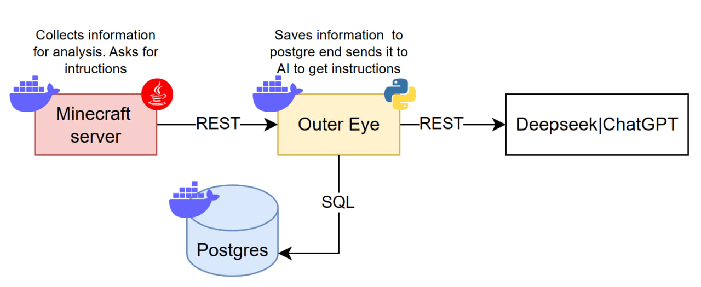

# OuterEye API
 
 
 
 
 
 

An API that uses AI to analyze player actions in Minecraft and influence the state of the server. Designed to accept requests from a local Minecraft server, which sends notifications about player actions through the endpoints, and to return instructions to the server based on the analysis of those actions.



## Project Structure

```text
OuterEye/
├── app/                              # Main FastAPI application
│   ├── main.py                       # FastAPI application entry point
│   ├── Dockerfile                    # Docker image for the API
│   ├── requirements.txt              # Python dependencies
│   │
│   ├── routes/                       # HTTP API endpoints
│   │   ├── __init__.py
│   │   ├── actions_notification.py   # Player action notifications
│   │   ├── analysis_requests.py      # Requests for AI analysis
│   │   └── scan_notification.py      # Player state/scan notifications
│   │
│   └── src/                          # Application core
│       ├── __init__.py
│       ├── auth.py                   # User identification/authentication
│       ├── database.py               # Database engine and session management
│       ├── models.py                 # SQLAlchemy ORM models
│       ├── open_ai.py                # LLM/AI integration
│       ├── services.py               # Application and database services
│       │
│       └── Schemas/                  # Pydantic request/response schemas
│           ├── notifications.py      # Notification schemas
│           ├── requests.py           # API request schemas
│           ├── response_data.py      # API response schemas
│           └── user_data.py          # User-related schemas
│
├── Database/
│   ├── docker-compose.yaml            # PostgreSQL container configuration
│   ├── Dockerfile                     # Database container configuration
│   └── init.sql                       # Initial database schema
│
├── Tests/
│   ├── test_actions.py                # Action endpoint tests
│   ├── test_requests.py               # Analysis/request endpoint tests
│   ├── test_scans.py                  # Scan endpoint tests
│   ├── requirements.txt               # Test dependencies
│   └── __init__.py
│
├── README.md                           # Project documentation
├── CHANGELOG.md                        # Project change history
└── .gitignore                          # Git ignored files
```

## Endpoints

| Method | Path | Description | Request Body | Success Response | Errors |
|---|---|---|---|---|---|
| `POST` | `/action/meal` | Record a meal action | `position: {pos_x, pos_y, pos_z}`, `meal_name: str` | `200 {"status": "created"}` | `422` — validation, `500` — DB error |
| `POST` | `/action/craft` | Record a crafting action | `position`, `craft_subject: str`, `craft_amount: int` | `200 {"status": "created"}` | `422`, `500` |
| `POST` | `/action/kill` | Record a kill action | `position`, `kill_type: str`, `kill_tool: str`, `kill_subject: UUID \| null` (optional), `kill_name: str \| null` (optional) | `200 {"status": "created"}` | `422`, `500` |
| `POST` | `/action/breed` | Record a breeding action | `position`, `father_subject_id: UUID`, `mother_subject_id: UUID`, `child_subject_id: UUID`, `child_type: str` | `200 {"status": "created"}` | `422`, `500` |
| `POST` | `/action/death` | Record a death action | `position`, `death_cause: str` | `200 {"status": "created"}` | `422`, `500` |
| `POST` | `/action/pray` | Record a prayer and get an AI-generated response | `position`, `pray_text: str` | `200 {"pray_respond": str}` | `422`, `500` (including external AI service failures) |
| `POST` | `/scan/position` | Record a position scan | `pos_x: int`, `pos_y: int`, `pos_z: int` | `200 {"status": "created"}` | `422`, `500` |
| `POST` | `/scan/inventory` | Record an inventory scan | `items: [{name: str, amount: int}, ...]` | `200 {"status": "created"}` | `422`, `500` |
| `GET` | `/analysis/scenario` | Get an AI-generated analysis of the user's recent actions/scans | — (no body, uses `CurrentUser`) | `200 {"analysis_respond": str}` | `500` (DB or AI service error) |

All endpoints require X-Username header, which provides the nickname — a missing or invalid header results in `401`/`403`.


